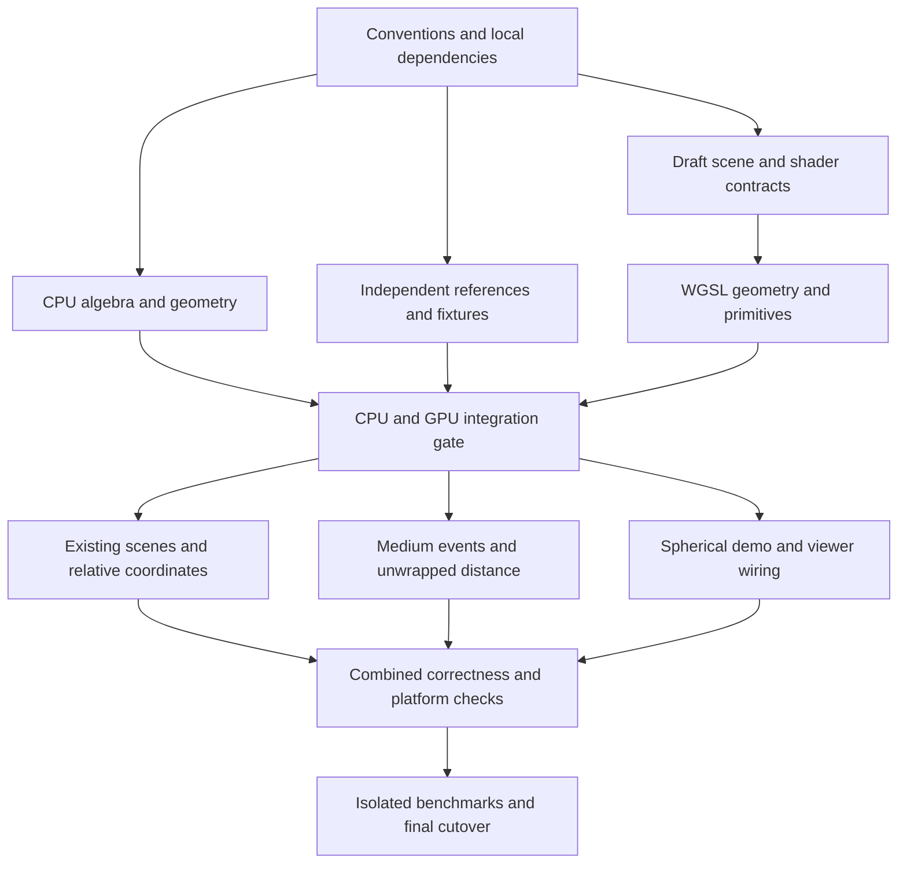

# Constant-curvature migration roadmap

Status: implemented locally, 2026-09-28. Shared libraries, generated tracing,
spherical scenes, and homogeneous transport are integrated. See
[MIGRATION_VALIDATION.md](MIGRATION_VALIDATION.md) for commits, measurements,
precision limits, and the remaining browser runtime acceptance check.

The numbered phases below retain the original design and acceptance criteria;
they are a roadmap record, not a claim that unavailable platform checks ran.

The objective is a shared Euclidean, hyperbolic, and spherical tracing kernel,
with explicit travelled distance, geometry-independent materials, and a path
contract that supports medium interactions after multiple spherical circuits.
Hyperbolic tracing moves from the upper half-space to the hyperboloid. Poincare
ball coordinates become an explicit scene-construction and inspection option.

This is a coordinated migration across `../vecmat-rs`, `../ccgeom`, and this
repository. The inspected starting commits are `ad071fb`, `4d64cc0`, and
`292dfc2`, respectively. Record fresh revisions when implementation begins.

**Decisions carried into the plan**

- Share algebra, geodesic advancement, transform application, tangent-frame
  handling, hit selection, and the integrator across the three curvature signs.
- Use four-component embedded points and tangent vectors in the tracing kernel.
  Spherical antipodes remain distinct points; there is no projective
  identification or division by `w` in the kernel.
- Use the hyperboloid for hyperbolic tracing. Keep ball and half-space
  conversions at explicit boundaries, including existing tiling coordinates.
- Target eight-scalar generalized quaternion-pair isometries. Prove their action
  against independent four-by-four matrices before adopting their GPU encoding.
- Keep material directions and normals in a three-dimensional orthonormal
  tangent frame. Ordinary material dot products then retain their meaning.
- Every event reports forward intrinsic travel distance. Position and tangent
  may repeat; distance and optical depth do not wrap.
- Use emissive objects and a configurable miss background. The new spherical
  demo defaults to black. Existing scenes keep their declared backgrounds.
- One spherical circuit can establish a deterministic surface miss in a static
  scene. It cannot establish the absence of a later stochastic medium event.
- Keep CPU transforms in f64 and GPU computation in f32. Add camera-relative
  scene preparation as part of the migration, with explicit numerical limits.

**Scope and completion boundary**

The core migration includes all existing scene functionality, spherical planes
and geodesic spheres, radius-bearing spheres in the other geometries, native and
web integration, and a minimal homogeneous-medium implementation or executable
transport fixture that verifies events beyond one circuit. The choice between
a public fog feature and a test-only transport fixture is made in phase 0; the
multi-circuit transport verification is required either way.

General heterogeneous media, anisotropic phase functions, spherical tilings,
triangles, acceleration structures, time-dependent scenes, and new importance
sampling algorithms are separate extensions. Their future interfaces must not
require changing the meaning of ray distance. Existing finite-bounce bias is
documented; this migration does not claim to solve it.

**Dependency order**

| Phase | Deliverable | Depends on | Completion evidence |
| --- | --- | --- | --- |
| 0 | Baselines, conventions, and API decisions | None | Reproducible existing scenes and a written contract |
| 1 | Local dependency integration | 0 | All three repositories use the intended library sources |
| 2 | Shared transform algebra | 1 | Quaternion-pair and independent matrix agreement |
| 3 | CPU geometry and coordinate conversions | 2 | Geometry invariants and distance/transport tests |
| 4 | Scene IR and shader contract | 3 | Validated layouts, lowering, and extension compatibility |
| 5 | WGSL geometry and analytic primitives | 4 | GPU results agree with CPU references |
| 6 | Existing scenes and relative coordinates | 5 | Euclidean/hyperbolic visual and numerical parity |
| 7 | Event transport and multiple circuits | 5; 6 for release | Analytic medium and periodic-intersection regressions |
| 8 | Spherical demo and native/web integration | 6, 7 | All three scenes work through the shared path |
| 9 | Performance, documentation, and cutover | 8 | Release checks and explicit compatibility decisions |

Each phase can contain several small commits. These dependencies describe
integration/completion gates, not a requirement to keep every contributor idle
until the previous phase finishes. Work against a fixed contract can overlap,
as described in the delegation plan below. Do not combine algebra replacement,
shader ABI changes, and scene conversion into one unreviewable change.

**Phase 0: establish reference behavior and freeze conventions**

The existing implementation is the reference for preservation of scene intent,
not an independent proof of the new mathematics.

1. Record revisions, toolchain, dependency resolution, GPU adapter, driver, and
   rendering settings. Capture existing `eu` and `hy` linear images, metadata,
   representative camera poses, tiling samples, and benchmark results.
2. Run current CPU and opt-in GPU checks before changing dependencies. Record
   pre-existing failures separately. The cloned `ccgeom` source differs from the
   registry source previously inspected; do not assume a path substitution is
   behavior-neutral.
3. Write conventions for scalar-first point/quaternion layout, handedness,
   camera forward axis, transform composition order, tangent normalization,
   outward normals, and material frames. Preserve `outer.chain(inner)` meaning
   `outer(inner(point))`.
4. Freeze the distance interval convention, including whether either endpoint
   is included. Specify on-surface starts, grazing contacts, coplanar rays, and
   suppression of only the immediate numerical self-hit.
5. Specify shape and custom-shader compatibility, physical units, supported
   curvature radii, and the minimal medium deliverable. These decisions precede
   changes to public types and shader layouts.

Completion gate: baseline artifacts and conventions are recorded; every later
comparison can identify its reference scene, seed, camera, and units. No
performance or numerical tolerance is chosen retrospectively to hide a failure.

**Phase 1: connect the local libraries and make builds reproducible**

Primary files: workspace `Cargo.toml`, crate manifests, `.travis.yml`, library
manifests, and development instructions.

1. Use workspace-level Cargo patches for `ccgeom` and `vecmat` pointing to
   `../ccgeom` and `../vecmat-rs`. Check the resolved dependency graph, including
   viewer dependencies, for unintended duplicate versions or registry copies.
2. Ensure standalone `ccgeom` development also uses the local `vecmat` changes;
   a patch in Hypertrace's workspace does not apply when invoking Cargo from
   the independent `ccgeom` root.
3. Add matching dependency checkout steps to CI and document the sibling layout,
   as is already necessary for `wgame`. Record compatible revisions for each
   migration checkpoint. Respect the current policy that ignores `Cargo.lock`;
   reproducibility must not silently depend on an untracked lockfile.
4. Fix any local-checkout compatibility issues in an isolated commit, before
   introducing the new geometry. Confirm library feature and no-std behavior
   where supported by `vecmat`.

Completion gate: the baseline builds and tests resolve the intended sources.
Any prerequisite API repair is separated from geometry changes.

**Phase 2: implement and verify the common transform algebra**

Primary location: `../vecmat-rs/src/complex` and associated tests. Geometry
constraints and geometry-specific isometry constructors belong in `ccgeom`.

Represent the algebra as a pair of ordinary quaternions `(a, b)`, corresponding
to `a + e*b` with central scalar `e` satisfying `e*e = k`. For normalized
curvature sign `k`, multiplication is:

```text
(a, b) * (c, d) = (a*c + k*b*d, a*d + b*c)
```

This encompasses complex, dual, and split biquaternions. Their geometric actions
are developed in [Arizmendi and Perez-de la Rosa](https://arxiv.org/abs/1906.11370).
The project still needs to fix and test its own component ordering and action
conventions.

1. Implement multiplication, the distinct conjugations, identity, composition,
   and the operations needed for inversion. Distinguish a general algebra
   element from a normalized isometry; do not make every pair a valid map.
2. Derive the point and tangent actions for each sign, including the Euclidean
   dual case. A correct multiplication formula alone does not establish a
   correct isometry implementation.
3. Add typed wrappers or marker types that prevent composition across different
   curvature signs. Avoid introducing a broad symbolic-algebra framework.
4. Build independent reference matrices from axis rotations and translations/
   boosts. Compare composition and action on basis vectors and general points;
   generating both sides through the same quaternion formula is not an
   independent check.
5. Test inverse round trips, preserved metric and orientation, long composition
   sequences, equivalent double-cover encodings, normalization drift, invalid
   input, and f32 conversion. Resolve sign canonicalization only where needed
   for comparison or serialization; avoid discontinuous camera behavior.

Completion gate: the three isometry families agree with the matrix references.
Eight-scalar GPU storage remains the target, but is not declared compatible
merely because its byte count matches the existing format.

**Phase 3: make `ccgeom` the CPU geometry authority**

Primary locations: `../ccgeom/src/geometry.rs`, `map.rs`, new shared geometry
modules, and explicit coordinate-model modules.

For normalized coordinates, use `P = (w, x, y, z)` and
`B_k(P,Q) = P.w*Q.w + k*dot(P.xyz,Q.xyz)`. Points satisfy `B_k(P,P) = 1`.
Hyperbolic points require `w > 0`; Euclidean points have `w = 1`.
For curved spaces, normalized unit tangents satisfy `B_k(P,V) = 0` and
`B_k(V,V) = k`. Euclidean tangents instead have `V.w = 0` and unit spatial norm;
the degenerate form at `k = 0` cannot define their lengths.

The common advancement rule is:

```text
P(t) = C_k(t)*P + S_k(t)*V
V(t) = -k*S_k(t)*P + C_k(t)*V

k = -1: C = cosh, S = sinh
k =  0: C = 1,    S = t
k = +1: C = cos,  S = sin
```

Curvature-dependent functions and the embedded models are described by
[Herranz and Ballesteros](https://www.maths.tcd.ie/EMIS/journals/SIGMA/2006/Paper010/sigma06-010.pdf).

1. Introduce explicit point, tangent, ray, and isometry contracts with checked
   construction at public boundaries. Keep `distance_between_points` separate
   from `advance(ray, travelled_distance)` and from hit ordering.
2. Start the kernel with normalized signs and radius one. Add a finite positive
   scene curvature radius `R` to the metric context before medium integration:
   physical distance `s` advances curved normalized coordinates by `t = s/R`;
   the physical curvature is `k/R^2`. Euclidean distance remains in world units.
   Expose physical-unit constructors and document how normalized tangent storage
   relates to physical unit speed. There is no spatially varying curvature.
3. Implement advancement, stable point distances, local-frame conversion, and
   transport along a specified ray segment. Do not infer winding or a unique
   arbitrary transport path from endpoint positions. Define failures or explicit
   choices for antipodal `look_at` and `move_at` operations.
4. Implement normalized-isometry camera movement through the shared API, with
   thin compatibility wrappers for existing axis methods where useful. Preserve
   the documented controller orientation and composition convention.
5. Add checked half-space/ball/hyperboloid conversions for both points and
   tangents. Transform derivatives, normal conventions, and scale factors must
   be tested; converting positions alone is insufficient. Distinguish an ambient
   unit tangent from a Euclidean-normalized direction in a conformal chart.
6. Keep existing half-space APIs as explicitly named adapters during migration.
   Do not silently change the coordinate meaning of an existing public type.

Completion gate: tests cover all curvature signs, several radii, advancement
composition, isometry equivariance, local-frame round trips, half-space parity,
and spherical travel through antipodes and several complete circuits. In
particular, `advance(s + n*2*pi*R)` repeats position/tangent while its supplied
physical travel distance remains distinct.

**Phase 4: migrate the scene representation and shader contracts**

Primary files: `objects/src/wgsl.rs`, `objects/src/shape/*`, `scene/src/lib.rs`,
`scene/src/compiler.rs`, `renderer-wgpu/src/scene.rs`, and shader assembly in
`renderer-wgpu/src/renderer.rs`.

1. Add spherical geometry and the shared isometry representation to lowering,
   camera data, scene validation, and generated programs. Treat geometry sign
   and shader API version as structural data; ordinary scene values remain
   buffer data. Changing sign must select a compatible program and reset
   accumulation. Changing radius also resets accumulation and follows the
   physical-unit policy fixed in phase 0.
2. Introduce a common embedded `Ray` and `Hit`. Define `Hit.distance` in physical
   units from the query ray origin, regardless of object transforms. Carry
   tangent and surface normal in a clearly specified frame.
3. Make the local material frame explicit. Built-in materials retain ordinary
   three-dimensional reflection, refraction, and hemisphere sampling. Preserve
   the distinction between mapping a shape inside a material and mapping the
   entire object, including position-dependent custom materials.
4. Add a radius-bearing geodesic sphere API with validation. Preserve the
   existing Euclidean unit `Sphere` through a wrapper or document a deliberate
   source migration. Curved isometries cannot be used to resize spheres.
5. Specify and validate a new shader contract version. Existing custom leaves
   use `vec3` ray/hit/context fields. Supply an explicit legacy adapter where
   semantics can be preserved, or reject old leaves with a migration diagnostic;
   never silently feed them four-coordinate positions.
6. Update word lengths, storage layout assertions, upload validation, structural
   shader reuse, and failed-update recovery. Keep leaf identities stable within
   the compiled payload for near-zero self-hit suppression.

Completion gate: all three geometries lower without a device; incompatible
geometry/map/leaf combinations fail clearly. Tests establish layout correctness,
parameter-only updates, shader changes, empty vectors, inactive choice variants,
nested mapped shapes, and custom material frame behavior.

**Phase 5: port shared geometry and analytic primitives to WGSL**

Primary locations: `renderer-wgpu/src/shaders/math.wgsl`, new geometry shader
modules as needed, generated shape functions, and `renderer-wgpu/tests/math.rs`.

1. Mirror the verified CPU algebra, metric operations, advancement, and tangent
   frames in WGSL. Specialize curvature sign when assembling a program, so
   generalization does not require dynamic dispatch in every operation.
2. Implement a physical-distance interval query. Return the first admissible
   forward root and reconstruct point/tangent through the shared advancement
   function. Preserve stable analytic limits for parallel and grazing cases.
3. Implement geodesic planes and radius-bearing spheres for all three signs.
   For curved spaces, plane sections and sphere equations reduce to scalar
   equations in `C_k(t)` and `S_k(t)`. Keep exact Euclidean limiting solvers where
   a curved equation loses information at zero curvature.
4. For spherical geometry, enumerate distinct roots within a period and lift
   them into the requested distance interval by adding whole periods. Preserve
   crossings beyond `pi*R`, repeated surface visits, and interval endpoints.
   Restrict geodesic sphere radii to `0 < r < pi*R`; radius `pi*R/2` is a great
   sphere and should agree with the corresponding plane intersection.
5. Preserve the Euclidean cube and hyperbolic horosphere as supported specialized
   primitives. Define the existing horosphere in embedded coordinates or use a
   temporary verified adapter; do not drop it during the kernel switch.
6. Replace whole-surface repeated-hit rejection with an identity-aware distance
   rule. A spherical ray leaving a plane must be allowed to hit it again later.
   Offsets, if used, need a defined distance/medium accounting policy.

Completion gate: GPU results agree with independent f64 references for distance,
point, tangent, normal, and validity. Tests include intervals beginning after
several circuits, nested maps, starts inside spheres, zero-distance starts,
near-tangency, and all existing primitive regressions.

**Phase 6: preserve existing scenes and introduce relative coordinates**

Primary files: `scenes/src/eu.rs`, `scenes/src/hy.rs`, tiling shaders, camera
upload and scene preparation, and existing generated-renderer regression tests.

1. Convert existing scene transforms and initial camera poses through explicit
   adapters. Keep materials, object ordering, tiling orientation, background,
   random draws, and bounce settings unchanged unless a documented bug requires
   a separate correction.
2. Convert embedded hits into the original object-local chart for current
   half-space tilings. These are surface/material coordinates, not the tracing
   representation. Test positions and normals at chart boundaries and mapped
   material frames.
3. Prepare camera-relative object transforms in CPU f64 before upload. Preserve
   canonical scene transforms so camera motion cannot accumulate changes in
   scene data. Update relative transforms on camera motion without recompiling
   the shader; accumulation still resets.
4. Define long-path recentering hooks and an explicit supported numerical range.
   A camera-relative origin does not keep every far-away object or later bounce
   well conditioned. Recentring must transform all relevant ray/object state
   consistently and leave physical distances and material coordinates intact.
5. Compare baseline and new renders, and inspect difference images. Preserve
   deterministic batching within each backend. Across different mathematical
   representations, use numerical and statistical comparisons rather than
   promising identical pixels after floating-point branching diverges.

The Poincare ball crowds precision near its boundary; the hyperboloid encounters
large coordinates and cancellation. This is a representation tradeoff, not a
guarantee that the new model is uniformly more accurate. See the
[numerical analysis by Mishne et al.](https://proceedings.mlr.press/v202/mishne23a/mishne23a.pdf).

Completion gate: `eu` and `hy` preserve their geometry, camera controls, material
frames, and tilings. Render differences and performance costs have explanations;
relative-coordinate motion passes invariance checks without pipeline churn.

**Phase 7: make event transport correct across multiple circuits**

Primary locations: `generated_trace.wgsl`, shared tracing functions, the
material/medium scene interface, and new event-transport tests.

Use this conceptual contract; names and exact layout are fixed in phase 0:

```text
advance(ray, physical_distance) -> RayState(position, unit_tangent)
intersect_surface(ray, distance_interval) -> SurfaceHit | no_surface
sample_medium(ray, maximum_surface_distance, rng) -> MediumOutcome
PathState: throughput, emission, total_travelled_distance, medium_state, ...
```

`MediumOutcome` distinguishes an interaction, absorption/termination, and
survival to a surface or a justified background outcome. A surface miss passes
an unbounded medium interval; it is not represented as a one-circuit endpoint.

1. Select the nearest geometric surface and sample medium transport up to that
   distance. If there is no surface, the medium query can extend through any
   number of circuits. Process the actual nearer event and add its physical
   segment length to the path total.
2. Verify homogeneous extinction with `s = -log(1-u)/sigma_t` for a scalar
   coefficient and open-interval random samples. Include scattering/absorption
   probabilities and estimator weights; an exponentially distributed distance
   alone is not a complete volume integrator. Handle `sigma_t = 0` explicitly.
3. Evaluate the position phase modulo `2*pi*R` when useful, while retaining
   unwrapped segment length for sampling density and transmittance. Use
   `T(s) = exp(-sigma_t*s)` in the homogeneous reference calculation. Do not
   apply attenuation twice if it is already accounted for by the estimator.
4. Keep cumulative path length separate from local query distance and geometric
   phase. Test the f32 range for large winding counts; use a winding-plus-phase
   or compensated representation if required by the documented range. Never
   reconstruct total travel from an endpoint pair.
5. Process transparent surfaces and null medium events without suppressing later
   encounters. A returned position does not signal a completed path. Existing
   bounce limits remain explicit; numerical progress limits cannot silently
   become a one-period travel cutoff or a background contribution.
6. Evaluate the configured background only after resolving both surface and
   medium outcomes. On a surface-free closed geodesic in homogeneous fog with
   positive extinction, a finite-distance medium event occurs almost surely.
   A vacuum miss can sample the background, initially black in the new demo.
7. Keep the medium API compatible with spatially varying optical depth
   `integral sigma_t(advance(ray,s).position) ds`. Repeated circuits contribute
   repeatedly. Heterogeneous sampling itself is a later extension.

The event-selection and transmittance/PDF treatment should follow a derived
estimator, checked against [PBRT's volume sampling discussion](https://pbr-book.org/3ed-2018/Light_Transport_II_Volume_Rendering/Sampling_Volume_Scattering).

Completion gate: forced random samples place medium events beyond one and
several circuits. Equal endpoint/tangent pairs at different distances have
different optical depths. Surface events still interrupt free flight when
closer. Black and nonblack background tests establish the intended miss policy.
Tests also prove that splitting a segment preserves analytic transmittance.

**Phase 8: deliver the spherical scene through native and web paths**

Primary files: new `scenes/src/sp.rs`, `scenes/src/lib.rs`, example support,
headless/viewer/benchmark options, and web controls.

1. Build an `sp` scene with emissive geometry, diffuse and specular/refractive
   examples, geodesic spheres of different radii, and a black constant miss
   background. Choose objects and camera poses that expose global curvature.
2. Add `sp` to CLI validation/help, browser selection, URL parameters, renderer
   setup, reset behavior, and benchmark metadata. A medium demonstration is
   included if phase 0 selected a public homogeneous-fog feature.
3. Verify travel across the antipode and a full camera circuit, stable local
   controls, resize, scene switching, accumulation reset, and failed-update
   recovery. Support the same generated scene on native WGPU and WebGPU.
4. Render inspectable previews and preserve scene/settings metadata. Check
   lighting and normals visually as well as checking that pixels are finite.

Completion gate: all three scenes run through the new generated renderer on a
native adapter and in a supported browser. No viewer-specific geometry fork is
needed, and black-background illumination comes from the emissive objects.

**Phase 9: measure, document, and complete the cutover**

1. Measure shader creation, render latency, camera-update uploads, and GPU
   resource usage against phase 0. Four-component ray state can increase
   register pressure even if isometries still occupy eight scalars. Optimize
   measured bottlenecks after correctness checks pass.
2. Update `README.md`, `ABOUT.md`, `TODO.md`, `renderer-wgpu/README.md`, and
   `site/theory.html`. Document coordinates, physical units, travel distance,
   tangent/material frames, media/background behavior, custom shader migration,
   supported precision range, and local library setup.
3. Keep the fixed-record old `Scene::eu()`/`Scene::hy()` path as a temporary
   comparison implementation until preservation checks pass. Then explicitly
   choose removal or a test-only home. Avoid maintaining two default production
   geometry stacks indefinitely.
4. Record the compatible revisions across the three repositories. Decide
   library release/version changes and removal dates for compatibility adapters
   independently of rendering correctness. Publishing libraries or the site is
   a separate action, not an implicit step of this roadmap.

Completion gate: the validation matrix below passes, known limitations are
documented, and the default viewer/headless paths use the shared kernel.

**Validation matrix**

| Concern | Required evidence |
| --- | --- |
| Transform algebra | Independent matrix action, composition, inverse, metric preservation, drift |
| CPU geometry | Point/tangent invariants for all signs, physical units, several radii |
| Coordinate adapters | Position and derivative round trips; legacy camera and tiling parity |
| Spherical roots | Near/far roots, beyond the antipode, later circuits, grazing and on-surface cases |
| Distance semantics | Identical endpoints with distinct travelled distances and optical depths |
| Medium transport | Analytic free-flight/transmittance checks and nearer-surface competition |
| Material frames | Reflection/refraction/diffuse sampling under object and nested shape transforms |
| GPU agreement | Production WGSL outputs versus independent f64 calculations |
| Scene compiler | ABI layouts, inactive variants, empty vectors, validation, custom-leaf versioning |
| Lifecycle | Parameter-only updates, sign/radius changes, camera motion, reset and resize |
| Compatibility | Existing geometry, light/material behavior, tilings, and controller pose preserved |
| Platform behavior | Native compute, software Vulkan where available, WASM build, browser smoke |
| Performance | Same adapter/settings baseline; inspectable image and latency comparisons |

Run checks at the phase that changes the corresponding behavior. At final
integration, the existing entry points provide the following starting set:

```sh
cargo test --manifest-path ../vecmat-rs/Cargo.toml
cargo test --manifest-path ../ccgeom/Cargo.toml
cargo fmt --all -- --check
cargo test --workspace --all-targets
cargo clippy --workspace --all-targets --features viewer -- -D warnings
cargo clippy -p hypertrace-wgpu --target wasm32-unknown-unknown --features web --example viewer -- -D warnings
WGPU_BACKEND=vulkan cargo test -p hypertrace-wgpu -- --ignored --test-threads=1
python3 -m unittest discover -s tools -p 'test_*.py'
NO_COLOR=true trunk build --release
```

Also run formatting and feature checks from each library root, plus native
viewer smoke runs for `eu`, `hy`, and `sp` and browser interaction checks.
GPU checks require a working adapter; a skipped or unavailable GPU suite is not
evidence of shader correctness. Use `tools/compare_frames.py` and
`tools/compare_benchmarks.py` for reproducible comparisons. The validation report records which checks ran and their outcomes.

**Main risks and the decisions that contain them**

| Risk | Response |
| --- | --- |
| Quaternion convention mismatch | Freeze conventions and prove action against independent matrices before WGSL |
| Zero-curvature degeneracy | Explicit Euclidean metric and limiting solvers; no division by curvature |
| Hidden shader/API break | Version the contract, provide adapters or explicit errors, migrate extension examples |
| Long-distance f32 failure | Camera-relative transforms, range tests, documented limits, later-path recentering hooks |
| Incorrect spherical termination | Separate geometric periodicity from stochastic transport and distance accumulation |
| Fog estimator bias | Derive event weights; compare analytic transmittance and distribution statistics |
| Hyperbolic appearance changes | Preserve object-local charts and compare baseline camera/tiling/material behavior |
| Migration expands indefinitely | Gate core completion; keep general media, tilings, and new integrators as follow-ups |

**Execution checkpoints**

The first reviewable implementation checkpoint is phases 0 and 1: recorded
baselines, fixed conventions, and the local dependency graph. The second is the
verified CPU geometry through phase 3. The third is GPU primitive agreement
through phase 5. Existing-scene preservation and multi-circuit transport then
precede the visible spherical release.

**Delegation plan and realistic parallelism**

Delegation is useful for this migration, especially for independent verification.
The useful unit is a layer with a fixed contract. Dividing the work into three
agents that each implement a different curvature would encourage incompatible
conventions and duplicate the logic this migration is intended to share.

Keep one coordinator responsible for public contracts and integration. Start
with the following division, using up to three specialist agents alongside the
coordinator once the contracts are ready:

| Owner | Responsibility | Primary write ownership | Can begin when |
| --- | --- | --- | --- |
| Coordinator | Conventions, dependency graph, scene IR/compiler, camera preparation, integrator, integration | Manifests, `scene/src/*`, lowering entry points, renderer scene/runtime contracts | Immediately |
| Mathematics agent | Shared algebra, CPU geometry, coordinate adapters | `../vecmat-rs` and `../ccgeom` implementation modules and their unit tests | Phase 0 conventions and phase 1 dependencies are fixed |
| Verification agent | Independent matrix/analytic references, adversarial fixtures, CPU/GPU cross-checks | Dedicated reference/test modules and comparison artifacts | Mathematical conventions are fixed; implementation need not exist yet |
| Shader agent | WGSL algebra, advancement, tangent frames, primitive solvers | Dedicated geometry/primitive WGSL modules | CPU signatures, equations, component layout, and draft shader contract are fixed |

The shader agent can implement against an agreed contract before the CPU
implementation is complete, but GPU acceptance must wait for the independent
references and scene integration. The coordinator owns edits to generated
dispatch and shared runtime files, or transfers ownership explicitly for a
bounded task. Do not have shader, medium, and scene agents concurrently edit
the same tracing functions.

The main waves are:

1. **Foundation:** coordinator settles conventions and compatibility. Baseline
   capture and independent mathematical review can assist, but public API design
   and dependency decisions remain coordinated. Parallel speedup is limited.
2. **Kernel:** library implementation, independent references, and WGSL geometry
   proceed concurrently against the fixed contract. Coordinator prepares scene
   IR and integration. This is the strongest opportunity for parallel work.
3. **Integration:** after the kernel passes, reuse agents for existing-scene
   adapters/tiling preservation, spherical demo/viewer work, and platform tests.
   Coordinator integrates medium events and travelled-distance accounting.
   Assign each shared file a single owner for the wave.
4. **Release checks:** numerical review, native/browser checks, and documentation
   can overlap. Run GPU benchmarks in isolation; competing GPU workloads make
   timings unreliable. Coordinator resolves findings and makes the cutover.



Every delegated task should name its input contract/revision, owned files,
required invariants, test command, expected artifact, and dependencies. Require
agents to report unresolved assumptions rather than independently changing
conventions. Library and shader disagreements go back to the shared contract;
tests must not simply be adjusted to match one implementation.

For this task, plan around two or three substantive concurrent work streams
after the foundation. Do not assume speedup proportional to the agent count:
the geometry-to-IR-to-renderer integration remains a sequential bottleneck.
Independent tests and review are valuable even when they do not shorten the
critical path. This delegation was used during implementation; final integration and commits remain coordinated.
